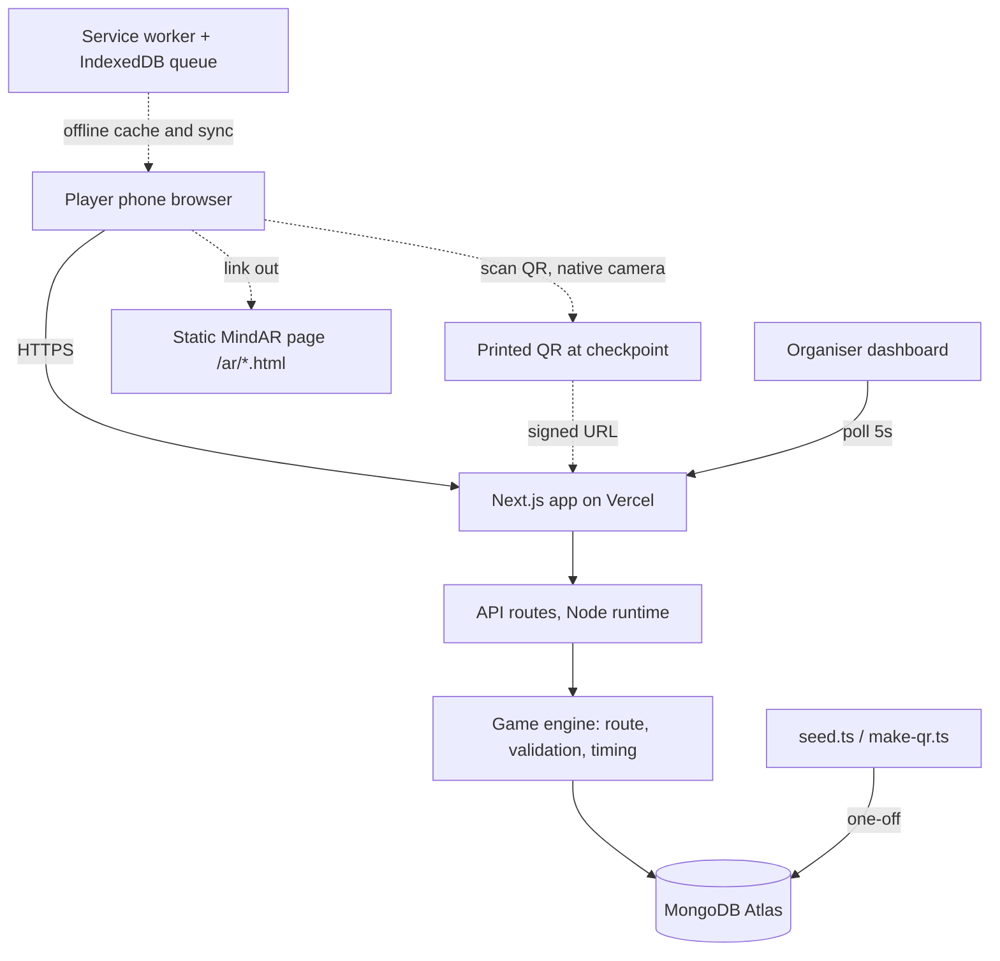
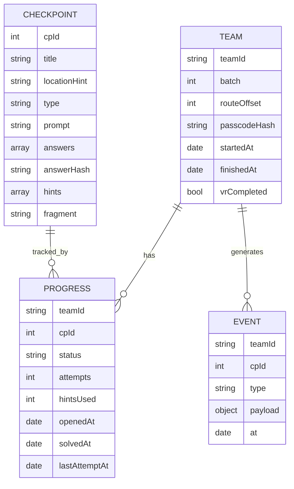

# ECHO Protocol Hunt — Architecture

> **Status:** Draft | **Last updated:** 2026-09-26

## 1. System Overview

A single Next.js application, deployed on Vercel, serving both the player-facing game and the organiser dashboard, backed by MongoDB Atlas. There is no separate backend service — the API routes live in the same repository and deploy together, which for an app with nine endpoints removes an entire class of CORS, versioning and deployment-order problems.

The system deliberately sits at the centre of the event but owns none of the physical or immersive pieces. AR runs as a standalone static page the player is linked to; the VR finale runs on a headset and is confirmed by a human tapping a button. The website's job is state: who is where, what they've solved, how long they've taken.

The most important architectural property is graceful failure. Every layer has a manual fallback — a stuck unlock has an admin override, a dead server has sealed paper envelopes at each checkpoint, and a dead network has offline play with deferred sync.

## 2. Architecture Diagram



## 3. Tech Stack

| Layer | Technology | Rationale |
|---|---|---|
| Frontend | Next.js 14 (App Router), React, Tailwind | Team already knows React; one repo for UI and API |
| Backend | Next.js API routes, Node runtime | Nine endpoints — a separate service would be overhead, not architecture |
| Database | MongoDB Atlas M0 (free) | Team knows MERN; document shape fits progress tracking well |
| ODM | Mongoose | Schema validation and a cached connection pattern that works on serverless |
| Hosting | Vercel Hobby | Free HTTPS (required for camera), push-to-deploy, no idle sleep |
| Auth | Signed JWT in httpOnly cookie via `jose` | No accounts to manage; works in both Node and Edge runtimes |
| Offline | `next-pwa` service worker + IndexedDB | The single highest-risk failure on campus |
| AR | MindAR + A-Frame, static HTML in `public/ar/` | Deliberately outside the React tree |
| Tooling | `tsx` for scripts, `qrcode` for QR generation | Seeding and QR printing are one-command operations |

**Explicitly rejected:** Express (nothing to gain), Redux (server holds all state), Docker (Vercel builds it), Firebase (would need Cloud Functions for answer validation anyway, making it two deploy targets), Flutter (install friction for 48 phones, and WebAR is JS/DOM).

## 4. Component Breakdown

### 4.1 Game engine (`lib/game.ts`)

- **Responsibility:** The only place that decides what a team does next. Route order, next checkpoint, elapsed time, ranking.
- **Interfaces:** `orderFor(team)`, `nextCheckpoint(teamId)`, `elapsedMs(team, events)`, `rank(teams)`.
- **Depends on:** Models only. No HTTP, no React — which makes it testable in isolation.

### 4.2 API routes (`app/api/**`)

- **Responsibility:** Authenticate the caller, call the game engine, write an event row, return the smallest possible payload.
- **Interfaces:** Nine JSON endpoints (section 6).
- **Depends on:** Game engine, models, auth helper.

### 4.3 Auth (`lib/auth.ts`)

- **Responsibility:** Sign and verify session cookies for teams and, separately, for admins.
- **Interfaces:** `signTeam(teamId)`, `signAdmin()`, `requireTeam(req)`, `requireAdmin(req)`.
- **Depends on:** `SESSION_SECRET`.

### 4.4 QR signing (`lib/hmac.ts`)

- **Responsibility:** Stop hand-typed checkpoint URLs. Not the primary anti-cheat — the sequence check is.
- **Interfaces:** `signCp(cpId)`, `verifyCp(cpId, token)`.
- **Depends on:** `QR_SECRET` (deliberately a different secret from the session one).

### 4.5 Offline layer (service worker + `lib/offline.ts`)

- **Responsibility:** Cache the open checkpoint, check answers locally against a salted hash, queue submissions, sync on reconnect.
- **Interfaces:** `queueSubmission()`, `flushQueue()`, `checkLocal(answer, hash)`.
- **Depends on:** `answerHash` supplied by the server when a checkpoint opens.

### 4.6 Content pipeline (`scripts/seed.ts`, `data/*.json`)

- **Responsibility:** Load all game content from JSON, compute answer hashes, validate the content before it reaches the database.
- **Interfaces:** `npm run seed`, `npm run qr`.
- **Depends on:** Nothing at runtime — it is a build-time tool.

## 5. Data Model



**Indexes (day one, not later):**

```js
teams:      { teamId: 1 } unique
progress:   { teamId: 1, cpId: 1 } unique   // also prevents duplicate rows under a race
events:     { teamId: 1, at: -1 }
```

**Two rules that shape everything:**

1. **Route order is derived, never stored.** One integer per team replaces twelve stored route lists.
2. **Score is computed, never accumulated.** Rankings are a pure function over `events`, so a scoring rule can be changed at 3pm on event day and reapplied retroactively.

## 6. API Design

| Method | Endpoint | Purpose | Auth required |
|---|---|---|---|
| POST | `/api/login` | Exchange Team ID + passcode for a session cookie | No |
| GET | `/api/state` | Current checkpoint, puzzle, progress, elapsed time | Team |
| POST | `/api/scan` | Validate a scanned QR and open the checkpoint | Team |
| POST | `/api/answer` | Submit an answer; advance on success | Team |
| POST | `/api/hint` | Reveal the next hint, apply the time penalty | Team |
| POST | `/api/final` | Submit the meta-code, mark the team VR-ready | Team |
| POST | `/api/admin/login` | Admin password for a separate session | No |
| GET | `/api/admin/live` | All teams in a batch with live status | Admin |
| POST | `/api/admin/override` | Release, unlock, mark solved, adjust time, reset | Admin |

Every route declares `export const runtime = 'nodejs'` — Mongoose does not run on the Edge runtime.

## 7. Infrastructure & Deployment

- **Environments:** local (`.env.local` against a separate Atlas database) and production (Vercel). No staging — the app is too small to justify a third environment.
- **CI/CD:** push to `main` deploys. Pull requests get preview URLs, which are useful for testing a puzzle change without touching the live game.
- **Environment variables:** `MONGODB_URI`, `SESSION_SECRET`, `QR_SECRET`, `ADMIN_PASSWORD`, `NEXT_PUBLIC_BASE_URL`. Set in Vercel, not only locally — a missing production variable is the classic week-8 surprise.
- **Base URL is frozen once QRs are printed.** Changing the domain after printing invalidates every signed QR. The generator prints the baked-in URL as a warning.
- **Backup:** `mongodump` of the seeded database the night before, restore tested once.

## 8. Security Considerations

The threat model is students with spare time and a browser, not attackers. Proportionate measures only.

- **Answers never leave the server.** Only `answerHash` (salted, per-checkpoint, only for the currently open checkpoint) is sent, and only for offline checking. Audit the network tab before the event.
- **Sequence enforcement is the real anti-cheat.** QR codes can be photographed freely; scanning ahead does nothing.
- **Signed QR URLs** stop hand-typed `/c/5`.
- **httpOnly, SameSite=Lax cookies** so session tokens aren't readable from JavaScript.
- **Admin is a separate credential and a separate cookie role**, checked in middleware on `/admin/*` and `/api/admin/*`.
- **Rate limiting:** 30-second cooldown per team per checkpoint on answers; roughly 10 login attempts per IP per minute.
- **Passcodes are hashed**, not stored in plaintext, even though they're printed on cards.
- **Every override is attributable** through the event log.

Out of scope: DDoS protection, GDPR-style data handling (no personal data beyond names), and account recovery.

## 9. Scalability & Performance

Peak load is 48 phones, and the real spike is the release moment when every team logs in within two minutes. That is small — the risk is not throughput, it is connection handling on serverless.

- **Cached Mongoose connection** in a global, with `maxPoolSize: 5`. Without this, each serverless invocation opens a new connection and exhausts Atlas M0 mid-event.
- **Payloads are minimal.** `/api/state` returns one checkpoint, not the whole game.
- **Dashboard polls every 5 seconds** for 12 rows. Websockets would be more code for no benefit at this size.
- **Service worker caching** takes repeat loads off the network entirely.
- **Load test before the event:** 20 simultaneous clients hitting `/api/answer`. Ten minutes of work that catches the connection ceiling while it's still fixable.

## 10. Key Technical Decisions & Tradeoffs

| Decision | Alternatives considered | Why this choice |
|---|---|---|
| Next.js API routes | Separate Express service; Firebase Cloud Functions | One repo, one deploy, no CORS. Nine endpoints don't justify a second service |
| MongoDB Atlas | Firestore, Postgres/Supabase | Team knows MERN; Firestore would still need server-side functions for answer validation, doubling deploy targets |
| Vercel | Render, Railway free tiers | Free tiers elsewhere sleep on idle — a 30–60s cold start at the release moment is unacceptable |
| No in-app QR scanner | `html5-qrcode`, ZXing in-app | Native camera opens URLs with zero code, zero permission prompt, and works on every phone. Building a scanner is the classic wasted week |
| Derived route order | Twelve stored route arrays | One integer, no seeding errors, no drift when an organiser overrides something |
| Computed score from event log | Incrementing a score field | Lets a scoring rule change mid-event and be reapplied. Also settles disputes |
| Offline via answer hashing | Optimistic accept-and-sync; no offline at all | Optimistic accept lets wrong answers advance a team; no-offline means a dead spot ends the run |
| Atomic conditional updates | Read-then-write with a check | Four phones per team means simultaneous submissions are routine, not an edge case |
| MindAR | 8th Wall, AR.js | 8th Wall's hosted platform shut down in 2026 (open-sourced, self-host only). AR.js is a weaker image tracker. MindAR is free and maintained |
| AR as a static page outside React | MindAR inside a React component | Keeps bundler and lifecycle problems away from the game; AR failing cannot take the game down |

## 11. Open Technical Questions

- [ ] Hint penalty value — 3 minutes assumed; confirm after a playtest.
- [ ] Does the clock keep running while a team queues for the headset, or does an organiser pause it?
- [ ] Per-batch answer variants: build the switch now, or only if batches share a ranking?
- [ ] Is one salted hash per checkpoint sufficient for offline, or should it rotate per team?
- [ ] Session length — 5 hours assumed, enough to cover a batch plus overrun.
- [ ] Do we keep the database after the event for a post-mortem, or wipe it?
