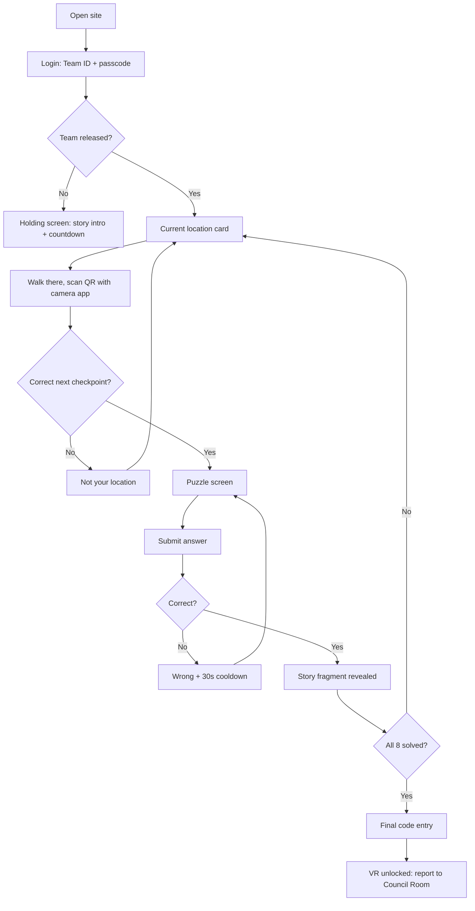
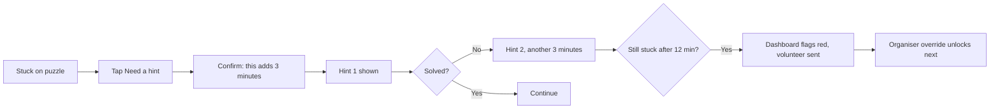

# ECHO Protocol Hunt — Design Document

> **Planning document, written before the build.** It is kept for the
> reasoning behind the design. Where it differs from [the README](../README.md)
> or the code, those win.

> **Status:** Draft | **Last updated:** 2026-09-26

## 1. Design Principles

- **One decision per screen.** A team is walking across campus in the sun, four heads around one phone. Every screen answers exactly one question: where do we go, or what's the answer.
- **Never show the whole map.** The mystery dies the moment a team can see all eight checkpoints. Show only what they've earned.
- **Dark, monospaced, slightly broken.** The site is ECHO's interface, not a college portal. Terminal aesthetic, a little glitch, nothing cute.
- **Failure states are part of the fiction.** "Signal lost — working offline" reads as the story, not as an error. This buys real goodwill when wifi actually drops.
- **The dashboard is the opposite.** Plain, dense, high-contrast, no theming. An organiser scanning it at a glance needs information, not atmosphere.

## 2. User Flows

### 2.1 Player flow, start to finish

The loop between "current location" and "story fragment" is the entire game. Everything else is entry and exit.

### 2.2 Getting stuck, and getting unstuck

The 12-minute red flag is the safety net. No team should ever be stranded long enough to stop enjoying it.

### 2.3 Organiser flow

Open `/admin` → log in → pick the active batch → release wave 1 → watch the table → act on amber and red rows → confirm VR completions as teams finish → open `/admin/board` on the projector at the end → export CSV.

## 3. Key Screens / Views

### 3.1 Login

- **Purpose:** Get a team into the game in under 15 seconds.
- **Key elements:** ECHO wordmark, one line of story ("ECHO has been activated"), Team ID field, passcode field, one button.
- **States:** *empty* — fields blank, button disabled; *loading* — button shows a spinner, fields locked; *error* — one line, "Team ID or passcode is wrong", fields kept so they don't retype everything; *success* — brief glitch transition into the holding or location screen.
- **Notes:** Team ID field forces uppercase and autocompletes nothing. Passcode is a plain text field, not a password field — nobody is shoulder-surfing a treasure hunt, and masking causes typos.

### 3.2 Holding screen (before release)

- **Purpose:** Hold a team that has logged in before their wave is released, without leaving them staring at nothing.
- **Key elements:** Story intro text, their team name, "Awaiting transmission…" with a slow pulse.
- **States:** *waiting* — pulsing; *released* — auto-advances within one poll, no refresh needed.

### 3.3 Current location card

- **Purpose:** Tell the team exactly where to walk.
- **Key elements:** Checkpoint number ("Fragment 3 of 8"), location name, a one-line story hook, and a large "Scan the code when you're there" prompt.
- **States:** *normal*; *offline* — a small amber chip, content still shown; *all solved* — replaced by the final code entry.
- **Notes:** No map, no directions, no distance. The hunt is the point.

### 3.4 Puzzle screen

- **Purpose:** Present the puzzle and take an answer.
- **Key elements:** Location name, puzzle text, optional media (audio player with an explicit play button, or an image), answer input, submit, hint button with the penalty stated on it, attempt count.
- **States:** *open* — ready; *submitting* — button locked; *wrong* — shake, message, 30-second countdown replacing the button; *cooldown* — live countdown; *correct* — fragment reveal transition; *offline* — "checked on your phone, will confirm when signal returns" chip.
- **Notes:** The answer field uses `autocapitalize=off`, `autocorrect=off`, `spellcheck=false`. Autocorrect silently mangling an answer is a real and infuriating failure.

### 3.5 Fragment reveal

- **Purpose:** The payoff moment. Deserves a beat of its own rather than a toast notification.
- **Key elements:** Fragment number, the story text, a note to collect the physical card from the volunteer, and "Next location →".
- **States:** *revealing* — short type-on animation; *revealed* — full text, continue button.

### 3.6 Story archive

- **Purpose:** Let a team re-read what they've found, which the final puzzle requires.
- **Key elements:** Eight slots. Unlocked ones show fragment text; locked ones show a redacted block.
- **States:** *partial* — mix of both; *complete* — all eight, with the final code entry surfaced.

### 3.7 Final code entry

- **Purpose:** The last gate before VR.
- **Key elements:** "Eight fragments recovered. Assemble the sequence." Code input. Submit.
- **States:** *ready*; *wrong* — same cooldown pattern; *correct* — full-screen ECHO ACTIVATED, then "Report to the AR/VR Council Room".

### 3.8 Admin dashboard

- **Purpose:** Run the event from one screen.
- **Key elements:** Batch selector, release-wave buttons, and one dense table — team, current checkpoint, minutes on it, attempts, hints, elapsed, status, actions.
- **States:** *live*; *stale* — banner if polling has failed for more than 15 seconds; *empty* — before any team is released.
- **Notes:** Amber at 8 minutes on a checkpoint, red at 12. Light background, no theming, readable on a laptop in daylight.

### 3.9 Leaderboard (projector)

- **Purpose:** The reveal at the end.
- **Key elements:** Rank, team name, total time, hints used. Huge type. Top three emphasised.
- **States:** *hidden during play* — separate URL, never opened in front of players mid-hunt; *final*.

## 4. Component Library / Style Guide

| Token | Value | Usage |
|---|---|---|
| Background | `#0b0d10` | Player app base |
| Panel | `#14171c` | Cards, puzzle containers |
| Line | `#232830` | Borders, dividers |
| Text primary | `#e8ecf1` | Body text |
| Text muted | `#8b95a3` | Labels, secondary info |
| ECHO green | `#4ade80` | Success, active state, the ECHO voice |
| Warning amber | `#fbbf24` | Offline chip, cooldown |
| Error red | `#f87171` | Wrong answer, red-flagged rows |
| Heading font | System mono stack (`ui-monospace`, `SFMono-Regular`, Menlo) | Terminal feel without a font download on bad wifi |
| Body font | Same mono, 16px minimum | Consistency, and mono is legible in sunlight |
| Spacing scale | 4 / 8 / 12 / 16 / 24 / 32 px | Tailwind defaults |
| Corner radius | 4px | Slightly hard — it's a machine, not an app |
| Touch target | 48px minimum | One-handed use while walking |

Admin views override this entirely: white background, dark text, system sans, dense rows.

**No web fonts.** A font download on a congested campus connection costs more than the aesthetic gains.

## 5. Interaction Patterns

- **Feedback within 100ms.** Every tap gets an immediate visual response, even if the server takes longer.
- **Wrong answers shake, they don't scold.** One short line, a shake, a countdown. No red banner, no "Incorrect!".
- **Correct answers earn a moment.** A short type-on reveal, roughly 800ms, then the continue button. Long enough to feel like a reward, short enough not to annoy on the eighth repetition.
- **Destructive admin actions confirm with a reason field.** Typing why also produces the audit trail for free.
- **Polling is invisible.** The play screen refreshes state quietly; nothing flashes or jumps while a player is reading.
- **Validation is forgiving.** Case, spaces and punctuation are stripped before comparison, and each answer has several accepted spellings.

## 6. Accessibility

- Target WCAG AA for contrast on all player screens; the green on near-black and amber on near-black combinations are checked, not assumed.
- Minimum 16px text, 48px touch targets.
- Every interactive element is a real `<button>` or `<a>` — keyboard and screen reader usable without extra work.
- Audio puzzles carry a text transcript behind a "can't hear it?" toggle, so a team with a broken speaker or a hearing-impaired member isn't blocked.
- Colour is never the only signal — offline shows an icon and text, not just an amber chip.
- Animations respect `prefers-reduced-motion`; the glitch effects are decorative and drop out cleanly.

## 7. Responsive / Platform Behavior

- **Player app is mobile-only in practice.** Designed at 360px wide, capped at 480px on larger screens so it doesn't stretch awkwardly.
- **Admin dashboard is desktop-first**, usable at 1280px and up; degrades to a scrollable table on a tablet. Not designed for phones, though an organiser can glance at it on one.
- **Leaderboard is designed for a projector** at 1920×1080, with type large enough to read from the back of the room.
- **iOS Safari specifics:** no audio autoplay, ever; `100vh` avoided in favour of `100dvh` because of the address bar; inputs at 16px to stop Safari zooming on focus.

## 8. Edge Cases & Error States

- Team scans a checkpoint that isn't theirs → "This isn't your next location" — never reveals where they should be.
- Team scans one they've already solved → "You've already recovered this fragment", with a link back to the current location.
- Network drops mid-puzzle → amber offline chip, puzzle still playable, answer checked locally, "will sync" state on submit.
- Answer queued offline turns out to be wrong on the server → dashboard flags it for an organiser rather than silently reversing the team's progress.
- Two members submit at the same instant → both see the success screen; only one solve and one penalty are recorded.
- Session expires mid-hunt → back to login with the checkpoint URL preserved, so one login returns them exactly where they were.
- Organiser overrides while the team is offline → applies on reconnect, with a short "the system has been updated" note.
- Team finishes but headsets are busy → "You've reached the Council Room. Wait for your slot" with their queue position.
- Media fails to load → text instructions still render with a retry link.
- Batch 1 team still playing when batch 2 is released → both visible on the dashboard, clearly labelled by batch.

## 9. Open Design Questions

- [ ] Does the team see their own elapsed time during the hunt, or only at the end? Showing it adds tension but can make slower teams give up.
- [ ] Should the story archive be readable before all 8 are collected, or only the current fragment? (Assumed: readable throughout.)
- [ ] How explicit should the hint penalty confirmation be — a modal, or a button that just states the cost?
- [ ] Does the holding screen show a countdown to release, or just a pulse? A countdown is friendlier but commits organisers to a precise time.
- [ ] Do we want a deliberate glitch effect on the final reveal, or is that over-designing the one moment that must not fail?
